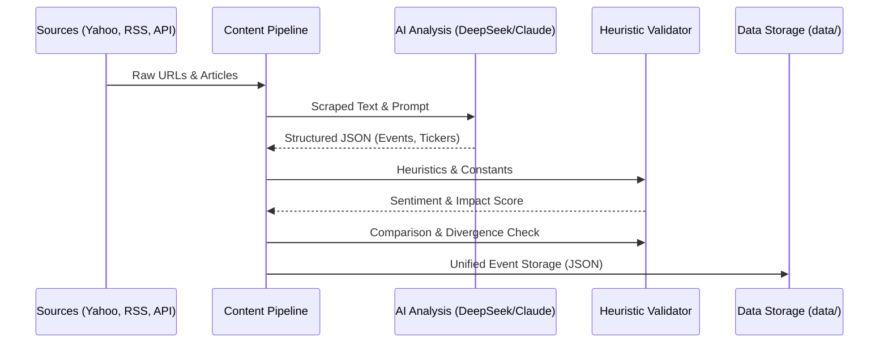

# FinIntelligence Engine 🚀

> **[View the Project Roadmap](ROADMAP.md)**

FinIntelligence is a high-performance, AI-driven financial news analysis engine. It automates the collection, extraction, and validation of market-moving events from diverse global sources (Yahoo Finance, RSS, Market APIs). 

By combining **LLM-based event extraction** with **deterministic heuristic validation**, it provides high-confidence signals with automated noise filtering.

---

## 🏗️ Architecture & Flow

The engine follows a multi-stage pipeline designed for precision and speed.

### System Sequence Diagram



### Directory Structure

```text
project_root/
├── main.py                  # Standard entry point
├── .env                     # Secrets (API Keys)
├── data/                    # Unified JSON storage
│   ├── visited_urls.json    # Deduplication state
│   ├── events.json          # Final extracted signals
│   └── entity_index.json    # Company mapping reference
└── src/                     # Source Package
    ├── ingestion/           # Scrapers and API clients
    ├── processing/          # AI logic & heuristic scoring
    ├── storage/             # State & persistent I/O management
    └── orchestrator/        # Main pipeline and prompt definition
```

---

## ✨ Key Features

- **🎯 Precision Extraction**: Uses LLMs to convert messy news text into canonical financial events (M&A, Earnings, Guidance).
- **🛡️ Hybrid Validation**: A secondary heuristic scoring layer validates AI results against 200+ financial keywords.
- **🏷️ Smart Ticker Tagging**: Automated ticker resolution with noise-filtering for symbols like `ON`, `IT`, and `CEO`.
- **⚡ High Performance**: Async ingestion and optimized deduplication of news stories across multiple sources.
- **🧩 Decoupled Design**: Modular architecture allows for easy swapping of AI models or news providers.

---

## 🚀 Getting Started

### 1. Prerequisites
- Python 3.9+
- [OpenRouter API Key](https://openrouter.ai/) for LLM access.

### 2. Installation
```powershell
pip install -r requirements.txt
```

### 3. Configuration
Create a `.env` file in the root directory:
```env
OPENROUTER_API_KEY=your_key_here
FINNHUB_API_KEY=optional_key
```

### 4. Run the Engine
```powershell
python main.py
```

---

## 🛠️ Components

### `src/processing/ai_client.py`
The bridge to LLM providers. Currently configured for optimized JSON extraction via DeepSeek or Claude-3.

### `src/processing/validator.py`
A deterministic engine that uses [constants.py](src/processing/constants.py) to calculate a "Heuristic Impact Score" and flag `divergence` if the AI sentiment disagrees with the keyword analysis.

### `src/storage/state_manager.py`
The data access layer that ensures safe, atomic saving of processed events and visited URLs.

---

## ⚖️ License
[MIT License] - (Placeholder)
